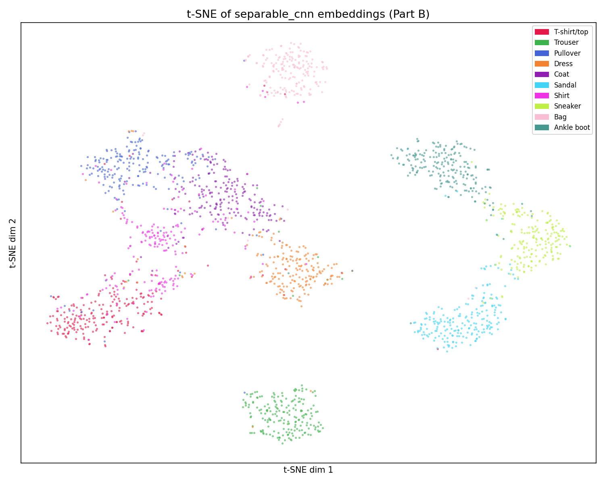
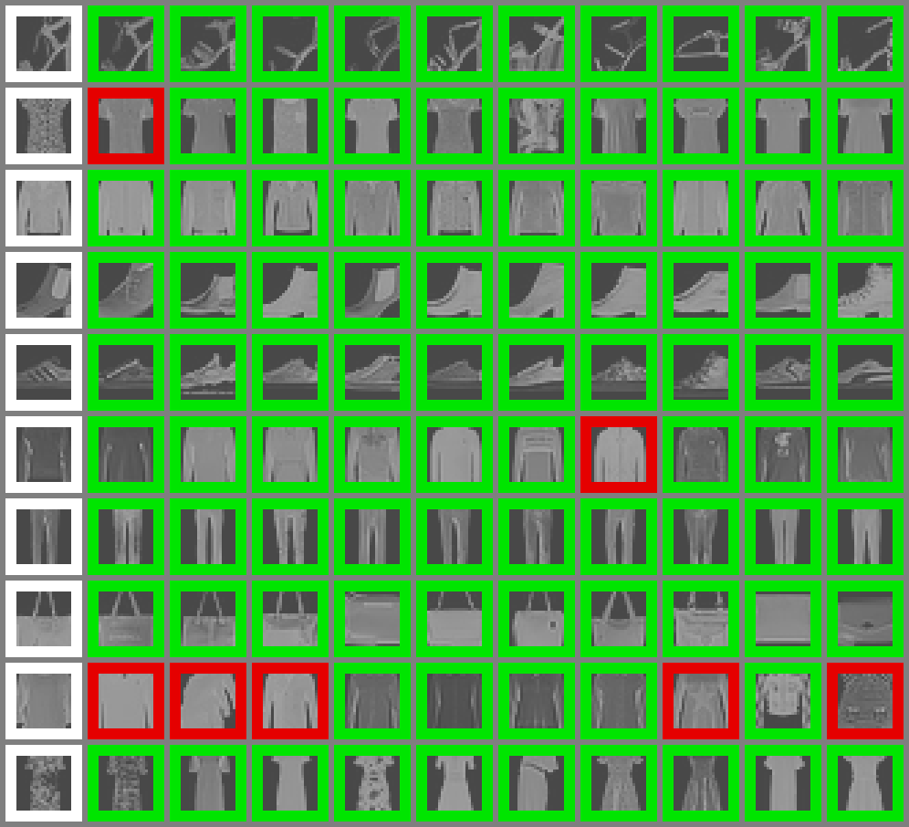
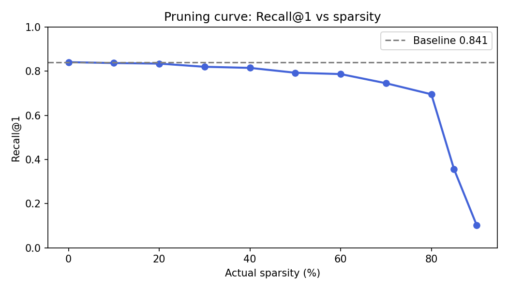

# Compact Fashion Vision System — Project Report

## Overview

This project builds a compact computer vision pipeline for a fashion platform across three connected stages: classification backbone comparison (Part A), metric learning for retrieval (Part B), 
and model compression via pruning and knowledge distillation (Part C). All experiments use FashionMNIST with the fixed data protocol from `src/data.py`.

---

## Part A: Backbone Comparison

### Setup

Two classifiers were trained on a fixed subset of 12,000 FashionMNIST training samples and evaluated on 2,000 validation samples (Adam optimiser, LR = 1e-3, cosine annealing over 15 epochs):

- **StandardCNN**: three standard 3×3 Conv2d layers (32 → 64 → 128 channels) with MaxPool and AdaptiveAvgPool.
- **SeparableCNN**: same macro-architecture but with depthwise separable convolutions — a depthwise 3×3 conv (groups=in\_channels) followed by a pointwise 1×1 conv, each with BatchNorm + ReLU.

The separable block replaces each full convolution with two cheaper operations, reducing parameters and FLOPs while preserving the receptive field and channel progression.

### Results

| Model | Accuracy | Macro F1 | Parameters | FLOPs |
|---|---|---|---|---|
| StandardCNN | 0.8165 | 0.8104 | 93,962 | 14,904,832 |
| SeparableCNN | **0.8850** | **0.8844** | **31,338** | **3,947,648** |

### Analysis

The SeparableCNN outperforms the StandardCNN on every metric simultaneously. 
It achieves 6.85 percentage points higher accuracy and 7.4 percentage points higher macro F1, while using **3× fewer parameters** and **3.8× fewer FLOPs**. 
This is a strong result that demonstrates the efficiency advantage of depthwise separable convolutions.

### Selected Backbone

**SeparableCNN** is selected for Part B. It is strictly better than StandardCNN in accuracy, F1, parameter count, and FLOPs — there is no tradeoff to consider.

---

## Part B: Metric Learning for Retrieval

### Setup

The SeparableCNN backbone was initialised from the Part A checkpoint. The classification head was replaced with a linear embedding head projecting to 64 dimensions. 
The model was fine-tuned for retrieval using **triplet loss** (margin = 0.5) on a fixed subset of 10,000 training samples, evaluated on 2,000 test samples via Recall@1.

Training used a two-phase schedule with cosine annealing LR decay over 40 epochs:
- **Warmup (epochs 1–10)**: backbone frozen, only the embedding head trained (backbone LR = 1e-5, head LR = 1e-4). This preserves the pre-trained features while the head adapts to the metric learning objective.
- **Full fine-tuning (epochs 11–40)**: entire model unfrozen with the same differential starting LRs, decayed to near zero by epoch 40.

Embeddings are L2-normalised before loss computation, so distances are cosine distances on the unit hypersphere. The provided `TripletFashionDataset` was used for deterministic, reproducible triplet construction.

### Results

| Epoch | Loss | Recall@1 |
|---|---|---|
| 1 | 0.0452 | 0.8375 |
| 10 | 0.0368 | 0.8350 |
| 20 | 0.0327 | 0.8375 |
| 28 | 0.0310 | **0.8410** |
| 40 | 0.0316 | 0.8365 |

**Best Recall@1: 0.8410** (epoch 28)

### Did the Retrieval Model Learn Meaningful Similarity?

Yes. The embedding space is clearly meaningful for retrieval, supported by two sources of evidence below.

**Recall@1 = 0.841** means that for 84.1% of query items, the single nearest neighbour in the embedding space belongs to the same class. 
On a 10-class problem this is far above the random baseline of 10%, and competitive for a compact model at 28×28 pixel resolution.

#### Embedding Space (t-SNE)

The t-SNE visualisation confirms the embedding space has learned strong class structure. 
Visually distinct categories — Trouser, Bag, Sneaker, Sandal and Ankle boot — form tight, well-separated clusters with virtually no overlap, 
indicating the model has learned highly discriminative embeddings for these classes.

More interesting is what the layout reveals about the harder classes. 
T-shirt, Shirt, Pullover, Coat form a loosely connected region on the left, which is expected given their shared silhouette as upper-body garments at 28×28 pixels. 
Within this region, the model places Shirts closest to T-shirts, while Pullovers and Coats cluster together, a distinction that aligns with how a human would reason about necklines and sleeve structure.

Dress occupies a notable position between the upper-body garment cluster and Trouser, 
suggesting the model has implicitly learned that dresses share properties with both, covering the torso like a top while extending downward like trousers. 
This is a clean emergent property of the embedding space rather than anything explicitly supervised.

On the right side of the plot, the three footwear classes — Sandal, Sneaker and Ankle boot — are placed near each other but remain clearly separated from all clothing categories, 
reflecting the model's understanding of the coarse clothing-vs-footwear distinction.

Overall, the confusions that do exist are not random errors but reflect genuine visual ambiguity in the data, 
the kind a human would also encounter at this resolution.
This is not a failure of the model; it reflects the inherent ambiguity in the data.

#### Retrieval Grid

The retrieval grid shows one query per row (white border) and its top-10 nearest neighbours. 
Green borders indicate a correct class match, red borders a mismatch. 
Rows for Sandal, Sneaker, Ankle boot, Trouser, Bag, and Dress are almost entirely green, 
showing the model retrieves the right class consistently for visually distinct categories.

The only consistent errors occur within the T-shirt/Pullover/Coat/Shirt cluster — and importantly, 
these mistakes are understandable even to a human observer. Looking at the mislabelled neighbours in the grid, 
it is genuinely difficult to tell whether a plain grey long-sleeved item is a Coat, a Pullover, or a Shirt at 28×28 pixel resolution with no colour information.
The errors are not random; the model is consistently confusing items that look alike, which is exactly the behaviour you would expect from a well-trained embedding space.

A retrieval system that confidently separates Sneakers from Ankle boots but occasionally confuses a Pullover with a Coat is making the right kind of mistakes.
---

## Part C: Compression

### C-1: Pruning

#### Method

Global unstructured magnitude pruning (`torch.nn.utils.prune.global_unstructured` with L1Unstructured) was applied to all Conv2d and Linear weight tensors at increasing sparsity levels. 
Global pruning was chosen over layer-wise pruning because it allocates the sparsity budget where weights are smallest across the entire network, rather than uniformly per layer.
This tends to preserve more performance at the same overall sparsity.

#### Results

| Target Sparsity | Non-zero Params | Recall@1 | Drop |
|---|---|---|---|
| 0% | 38,302 | 0.8410 | — |
| 10% | 34,590 | 0.8370 | −0.0040 |
| 20% | 30,878 | 0.8345 | −0.0065 |
| 30% | 27,166 | 0.8200 | −0.0210 |
| 40% | 23,454 | 0.8150 | −0.0260 |
| 50% | 19,742 | 0.7930 | −0.0480 |
| 60% | 16,030 | 0.7870 | −0.0540 |
| 70% | 12,318 | 0.7455 | −0.0955 |
| 80% | 8,606 | 0.6955 | −0.1455 |
| 85% | 6,750 | 0.3560 | −0.4850 |
| 90% | 4,894 | 0.1020 | −0.7390 |

#### Analysis

The pruning curve shows two distinct regimes. 
Up to **60% sparsity**, Recall@1 degrades slowly and approximately linearly — the model retains 93.6% of its retrieval performance while discarding 60% of its weights. 
This suggests the network has substantial redundancy, and the most informative weights carry most of the retrieval signal.

Between **80% and 85%** there is a sharp cliff — Recall@1 collapses from 0.70 to 0.36, suggesting a critical threshold below which the remaining weights can no longer represent the embedding space coherently.
This is consistent with the behaviour of global magnitude pruning, which eventually removes weights that are small in magnitude but structurally important.

At **90% sparsity**, the model is effectively non-functional for retrieval (Recall@1 = 0.102), basically random performance on a 10-class problem, 
confirming that the pruning has removed too much of the model's capacity to represent meaningful similarity.

The practical sweet spot for deployment is **50–60% sparsity**: ~16,000–19,000 non-zero parameters, Recall@1 ≥ 0.787, with no retraining required.

---

### C-2: Knowledge Distillation

#### Method

The Part B SeparableCNN teacher (Recall@1 = 0.841) was used to train the fixed `CompactSeparableCNN` student. 
Distillation used an embedding-alignment loss — MSE between L2-normalised student and teacher embeddings scaled by a temperature of 4.0 — trained for 20 epochs with Adam (LR = 3e-4, cosine annealing). 
The student was initialised from random weights.

#### Results

| | Recall@1 | Parameters | FLOPs (approx.) |
|---|---|---|---|
| Teacher (SeparableCNN) | 0.8410 | 38,304 | 3,947,648 |
| Student before distillation | 0.3150 | 12,528 | ~1,300,000 |
| Student after distillation | **0.7855** | 12,528 | ~1,300,000 |

**Retrieval retention: 93.4%** at **3.1× parameter compression**.

#### Analysis

The student begins near random (Recall@1 = 0.315) since it is randomly initialised. 
After 20 epochs of distillation, it reaches 0.7855 — retaining 93.4% of the teacher's performance despite having 3.1× fewer parameters and roughly 3× fewer FLOPs. 
The training curve is stable and monotonically improving with no sign of overfitting, 
indicating the student has learned to mimic the angular structure of the teacher's embedding space rather than memorising individual examples.

---

## Final Discussion: Deployment Tradeoff

| Model | Recall@1 | Parameters | Relative FLOPs | Notes |
|---|---|---|---|---|
| Teacher (SeparableCNN) | 0.841 | 38,304 | 1.0× | Best quality |
| Pruned 50% | 0.793 | 19,742 | 1.0× (sparse) | Same architecture, fewer active weights |
| Pruned 60% | 0.787 | 16,030 | 1.0× (sparse) | Near student quality, no retraining |
| Distilled student | 0.786 | 12,528 | ~0.33× | Smaller architecture, faster on any hardware |

Both compression methods achieve similar Recall@1 (~0.79) at similar parameter counts, but through different mechanisms with different deployment implications.

**Pruning** keeps the original architecture with zeroed weights. 
The FLOPs reduction only materialises with hardware or runtime support for sparse operations. 
Without such support, the pruned model runs at the same speed as the original.
Its advantage is that no retraining is needed and it can be applied post-hoc to any checkpoint.

**Distillation** produces a smaller architecture with ~3× fewer parameters and ~3× fewer FLOPs in dense arithmetic on any hardware — gains that are realised without requiring sparse operation support.

### What Final Model Would Be Deployed?

**The distilled CompactSeparableCNN** is the recommended deployment model. 
It retains 93.4% of teacher retrieval quality at 3.1× fewer parameters and approximately 3× fewer FLOPs, and those gains are realised on any hardware. 
For a fashion platform running on limited hardware, this tradeoff is clearly worthwhile: the user experience difference between 84.1% and 78.6% top-1 retrieval accuracy is small in practice,
while the efficiency gains directly reduce latency and cost at inference time.

---

## Report Questions

**Which backbone would you keep after comparing CNN and separable CNN, and why?**

The SeparableCNN, it achieves higher accuracy (0.885 vs 0.817), higher macro F1 (0.884 vs 0.810), 3× fewer parameters (31,338 vs 93,962), and 3.8× fewer FLOPs (3.9M vs 14.9M). 
There is no metric on which the StandardCNN wins. 
The depthwise separable factorisation reduces computation without sacrificing — and in this case improving — generalisation.

**Did your retrieval model learn meaningful similarity?**

Yes, Recall@1 = 0.841 on the held-out eval set, the t-SNE visualisation shows tight, well-separated clusters for visually distinct classes, 
and the retrieval grid shows near-perfect results for structurally distinct categories. 
The remaining errors (T-shirt vs Shirt vs Pullover vs Coat) reflect genuine visual ambiguity at 28×28 pixels, that even a human would struggle with, rather than random mistakes.

**How much performance was preserved after pruning and distillation?**

Pruning at 50% sparsity preserves 94.3% of Recall@1 (0.793 vs 0.841). 
At 60% sparsity it preserves 93.6% (0.787). 
The model is robust up to ~80% sparsity before catastrophic degradation at 85%. 
Knowledge distillation into the compact student preserves 93.4% of Recall@1 (0.786 vs 0.841) at 3.1× parameter compression.

**What final model would you deploy, and why?**

The distilled CompactSeparableCNN, it retains 93.4% of teacher retrieval quality at 3.1× fewer parameters and ~3× fewer FLOPs in dense arithmetic, 
making it the most practically efficient model for standard embedded without requiring sparse operation support.